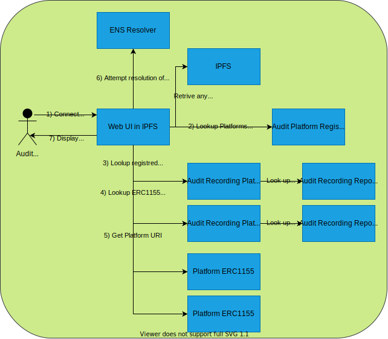
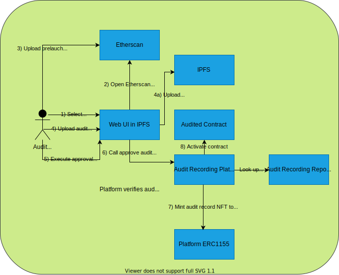

= AuditDAO On-Chain Audit Recoridng Platform

This code base is freely available to any auditor or firm to record their own audits.
This is intended a reference architecture that can be used whole or in part.
The code is licensed under the AGPLv3 license to encourage the sharing of any modifications for improvements to benefit the community as a whole.

== Auditor Portal usage

=== Auditor Login Workflow

=== Auditor Audit Approve Workflow

== environment installation

**********************************************************************************

npm install --save-dev hardhat ethers mocha chai ethereum-waffle @nomiclabs/hardhat-waffle @nomiclabs/hardhat-ethers @openzeppelin/test-helpers hardhat-gas-reporter; npm install solidity-docgen buidler-source-descriptor

**********************************************************************************

npm init --yes

npm install -g solc truffle-flattener 

npm install --save-dev hardhat @nomiclabs/hardhat-waffle ethereum-waffle chai @nomiclabs/hardhat-ethers ethers mocha @nomiclabs/hardhat-truffle5 @nomiclabs/hardhat-web3 web3 @openzeppelin/test-helpers hardhat-gas-reporter nyc

npm install solidity-docgen buidler-source-descriptor